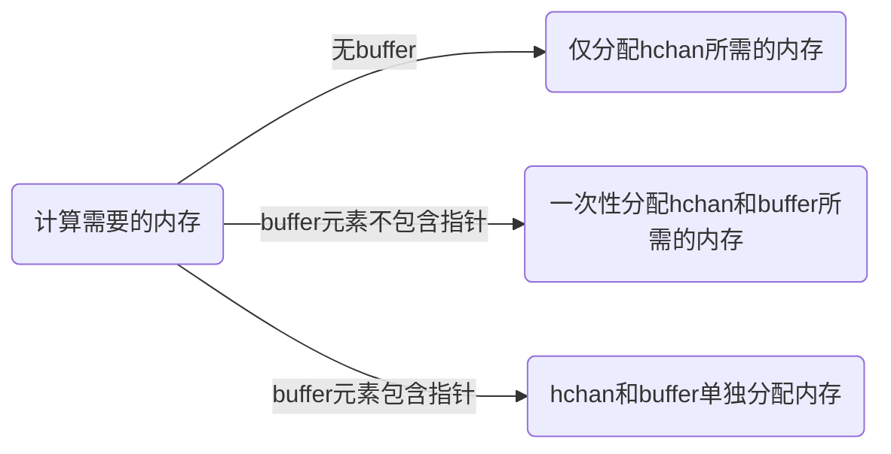
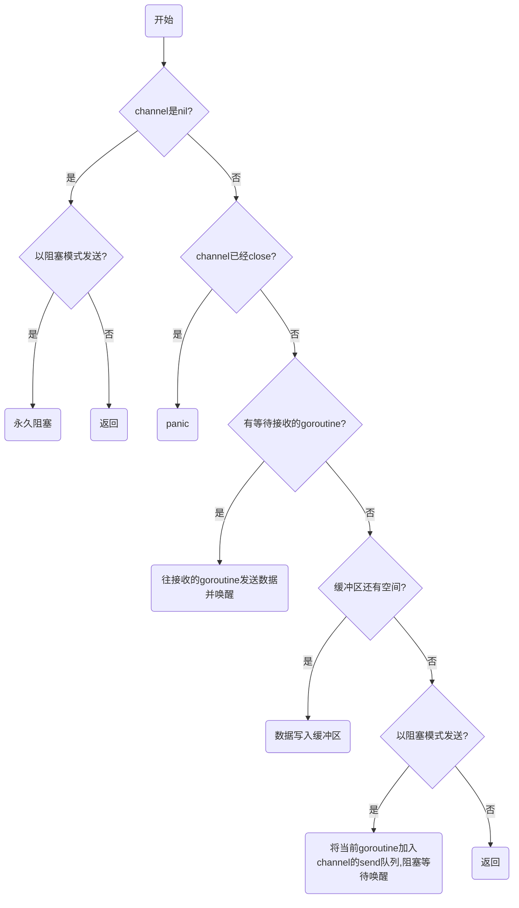
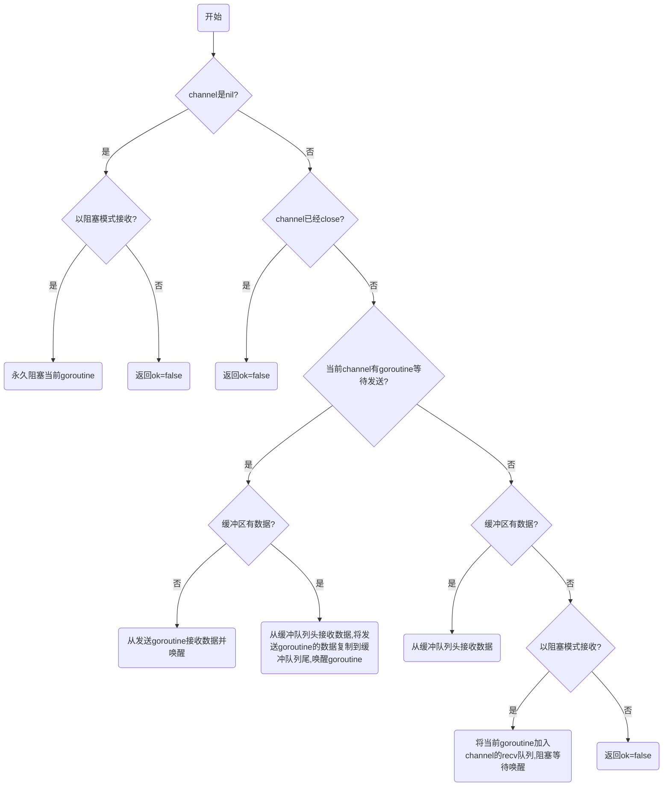

> Do not communicate by sharing memory; instead, share memory by communicating.

go是一门对于并发编程很友好的语言。开发者可以通过channel在多个goroutine之间传递消息，从而简单而优雅地控制并发。相比于加锁访问共享内存，使用channel也是官方更提倡的方式。那么channel究竟是怎么实现的呢？让我们阅读代码来一探究竟。

我们使用的go版本为**go1.14.4**，为了方便阅读，非关键路径的代码不会贴出。

# channel定义与初始化

表示channel的数据结构定义如下：

```go
type hchan struct {
	qcount   uint           // total data in the queue
	dataqsiz uint           // size of the circular queue
	buf      unsafe.Pointer // points to an array of dataqsiz elements
	elemsize uint16
	closed   uint32
	elemtype *_type // element type
	sendx    uint   // send index
	recvx    uint   // receive index
	recvq    waitq  // list of recv waiters
	sendq    waitq  // list of send waiters

	lock mutex
}
```

可以看到，hchan结构体的核心包含：

1. buf，一个环形的缓冲队列，用来实现buffered channel。
2. closed，表示该channel是否关闭的变量。
3. 两个waitq，可以不精确地理解为用来表示阻塞在该channel的goroutine队列。recvq为等待队列，sendq为发送队列。
4. elemtype，_type类型的指针，表示channel中的元素是什么类型。
5. lock，控制并发互斥锁。

注意elemsize的类型是uint16，channel可以传递的元素大小**最大为64k**。

我们知道，go中make关键字本质上是编译器提供的语法糖，在编译阶段，go编译器会根据需要make的类型（map/slice/channel）替换成具体的函数。channel对应的make函数为makechan。

```go
func makechan(t *chantype, size int) *hchan {
   elem := t.elem

   // ...
   mem, overflow := math.MulUintptr(elem.size, uintptr(size))
	 if overflow || mem > maxAlloc-hchanSize || size < 0 {
	  	panic(plainError("makechan: size out of range"))
	 }
  
   var c *hchan
   switch {
   case mem == 0:
      // Queue or element size is zero.
      c = (*hchan)(mallocgc(hchanSize, nil, true))
      // Race detector uses this location for synchronization.
      c.buf = c.raceaddr()
   case elem.ptrdata == 0:
      // Elements do not contain pointers.
      // Allocate hchan and buf in one call.
      c = (*hchan)(mallocgc(hchanSize+mem, nil, true))
      c.buf = add(unsafe.Pointer(c), hchanSize)
   default:
      // Elements contain pointers.
      c = new(hchan)
      c.buf = mallocgc(mem, elem, true)
   }

   c.elemsize = uint16(elem.size)
   c.elemtype = elem
   c.dataqsiz = uint(size)

   return c
}
```

makechan对于对于不同的情况有不同的内存分配策略，创建channel实际返回的是hchan结构体的指针。



# 发送数据

go使用<-运算符表示channel发送数据的操作，分为阻塞和非阻塞的方式。以下代码

```go
ch <- x
```

是以阻塞方式将x发送到ch，执行该语句的goroutine会阻塞直到发送完成。编译器会将该语句替换为chansend1函数调用。

位于select中的<-是以非阻塞的方式发送数据。

```go
select {
case ch <- x:
  // do something
default:
  // do other thing
}
```

如果ch准备好了接受数据（缓冲区还有空间或者有goroutine在等待接收），那么执行发送操作，否则直接返回false。编译器会将该语句替换为selectnbsend的函数调用。

无论是chansend1还是selectnbsend，内部都是调用的chansend函数。

```go
func chansend(c *hchan, ep unsafe.Pointer, block bool, callerpc uintptr) bool {
	if c == nil {
		if !block {
			return false
		}
		gopark(nil, nil, waitReasonChanSendNilChan, traceEvGoStop, 2)
		throw("unreachable")
	}

	if !block && c.closed == 0 && ((c.dataqsiz == 0 && c.recvq.first == nil) ||
		(c.dataqsiz > 0 && c.qcount == c.dataqsiz)) {
		return false
	}

	lock(&c.lock)

	if c.closed != 0 {
		unlock(&c.lock)
		panic(plainError("send on closed channel"))
	}

	if sg := c.recvq.dequeue(); sg != nil {
		send(c, sg, ep, func() { unlock(&c.lock) }, 3)
		return true
	}

	if c.qcount < c.dataqsiz {
		qp := chanbuf(c, c.sendx)
		typedmemmove(c.elemtype, qp, ep)
		c.sendx++
		if c.sendx == c.dataqsiz {
			c.sendx = 0
		}
		c.qcount++
		unlock(&c.lock)
		return true
	}

	if !block {
		unlock(&c.lock)
		return false
	}

	// Block on the channel. Some receiver will complete our operation for us.
	gp := getg()
	mysg := acquireSudog()
  // ...
	c.sendq.enqueue(mysg)
	gopark(chanparkcommit, unsafe.Pointer(&c.lock), waitReasonChanSend, traceEvGoBlockSend, 2)
  // ...
	// someone woke us up.
  // ...
	releaseSudog(mysg)
	return true
}
```

可以看到整个流程还是很清晰的：



整理一下发送数据的行为，其中有些边界case（比如nil或close的channel）是我们编写代码中需要注意的。

* 向close的channel发送数据会panic。

* 向nil的channel发送数据，非阻塞模式会返回false，阻塞模式会永久阻塞。
* 发送数据时，会先判断是否有等待的goroutine，再判断缓冲区是否有空间。最后才会将自身加入等待队列。
* 非阻塞模式，接收没有ready时，会直接返回。注意这个判断是不用加锁的。

# 接收数据

go使用<-运算符表示channel接收数据的操作，分为阻塞和非阻塞的方式。以下代码

```go
x := <- ch     // 1
y, ok := <- ch // 2
<- ch          // 3
```

是以阻塞方式将从ch接收数据，执行该语句的goroutine会阻塞直到发送完成。当然你也可以使用channel来同步操作，而不需要实际接收数据，如同第3种形式。

对于第1/3种形式，编译器会将该语句替换为chanrecv1函数调用。对于第2种形式，编译器会将该语句替换为chanrecv2函数调用，返回值ok用来表示是否读取到了数据。ok为false的话，表明ch已经关闭了，得到的y为channel元素类型的零值。

位于select中的<-是以非阻塞的方式接收数据，第1/3种形式会被编译器替换为selectnbrecv，第2种形式会被编译器替换为selectnbrecv2。

```go
select {
case <- ch:
  // do something
default:
  // do other thing
}
```

chanrecv1，chanrecv2，selectnbrecv，selectnbrecv2内部均是调用chanrecv函数来完成功能。

```go
func chanrecv(c *hchan, ep unsafe.Pointer, block bool) (selected, received bool) {
	if c == nil {
		if !block {
			return
		}
		gopark(nil, nil, waitReasonChanReceiveNilChan, traceEvGoStop, 2)
		throw("unreachable")
	}

	if !block && (c.dataqsiz == 0 && c.sendq.first == nil ||
		c.dataqsiz > 0 && atomic.Loaduint(&c.qcount) == 0) &&
		atomic.Load(&c.closed) == 0 {
		return
	}

	lock(&c.lock)

	if c.closed != 0 && c.qcount == 0 {
		unlock(&c.lock)
		if ep != nil {
			typedmemclr(c.elemtype, ep)
		}
		return true, false
	}

	if sg := c.sendq.dequeue(); sg != nil {
		recv(c, sg, ep, func() { unlock(&c.lock) }, 3)
		return true, true
	}

	if c.qcount > 0 {
		// Receive directly from queue
		qp := chanbuf(c, c.recvx)
		if ep != nil {
			typedmemmove(c.elemtype, ep, qp)
		}
		typedmemclr(c.elemtype, qp)
		c.recvx++
		if c.recvx == c.dataqsiz {
			c.recvx = 0
		}
		c.qcount--
		unlock(&c.lock)
		return true, true
	}

	if !block {
		unlock(&c.lock)
		return false, false
	}

	// no sender available: block on this channel.
	gp := getg()
	mysg := acquireSudog()
  // ...
	c.recvq.enqueue(mysg)
	gopark(chanparkcommit, unsafe.Pointer(&c.lock), waitReasonChanReceive, traceEvGoBlockRecv, 2)

	// someone woke us up
  // ...
	releaseSudog(mysg)
	return true, !closed
}

```

整个流程同样很清晰，和发送数据的流程基本是对称的



总结一下大致是：

* 从close的channel接收会得到零值
* 从nil的channel接收，非阻塞模式会得到零值，阻塞模式会永久阻塞当前goroutine
* 注意从channel接收，当有已有发送goroutine阻塞在channel上，且缓冲队列有数据时，处理是比较复杂的。这是为了保证channel的FIFO特性。

# 关闭通道

相比之下，关闭channel的底层函数逻辑就很简单了。

```go
func closechan(c *hchan) {
	if c == nil {
		panic(plainError("close of nil channel"))
	}

	lock(&c.lock)
	if c.closed != 0 {
		unlock(&c.lock)
		panic(plainError("close of closed channel"))
	}

	c.closed = 1

	var glist gList

	// release all readers
	for {
		sg := c.recvq.dequeue()
		if sg == nil {
			break
		}
		if sg.elem != nil {
			typedmemclr(c.elemtype, sg.elem)
			sg.elem = nil
		}
		glist.push(gp)
	}

	// release all writers (they will panic)
	for {
		sg := c.sendq.dequeue()
		if sg == nil {
			break
		}
		sg.elem = nil
		gp := sg.g
		gp.param = nil
		glist.push(gp)
	}
	unlock(&c.lock)

	// Ready all Gs now that we've dropped the channel lock.
	for !glist.empty() {
		gp := glist.pop()
		gp.schedlink = 0
		goready(gp, 3)
	}
}

```

简单来说会清空channel的recv队列和send队列，并唤醒这些队列中的goroutine。注意send队列中的goroutine被唤醒后会panic。此外，关闭一个nil的channel和已经关闭过的channel也会panic。

# 总结

通过阅读源码我们可以发现实际上channel底层也是通过锁+复制的方式来实现数据的传递。go通过在锁的基础上封装一层，提供了更高级的并发编程模型[CSP](https://en.wikipedia.org/wiki/Communicating_sequential_processes)。虽然实现看起来逻辑分支多，但是阅读起来却很清晰很好理解。再次感叹设计的精妙，这是我们自己编程时需要学习的。

> All problems in computer science can be solved by another level of indirection.
>
> ​                                                                                                                                                     by Butler Lampson

